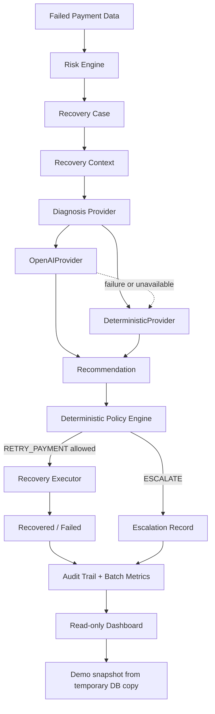

# RecoverAI Architecture

## 1. System overview

RecoverAI is a focused revenue-recovery orchestration MVP for merchants. It detects failed payments that represent revenue at risk, scores and prioritizes them, diagnoses likely causes, validates any proposed action through deterministic policy rules, and records the result in an audit trail. The core design is safety-first: AI can recommend, but it cannot directly execute a customer-impacting payment action.

## 2. End-to-end architecture

This is the implemented decision path in the MVP: failed payment data becomes a prioritized recovery case, the diagnosis provider produces a constrained recommendation, the deterministic policy engine decides whether the action is permissible, and the remaining outcome is recorded in audit and metrics.

## 3. Component responsibilities

### Failed Payment Data

The seeded dataset contains failed and successful payment records. The current workflow is built around failed payments that represent meaningful revenue at risk.

### Risk Engine

The risk engine scores failed payments and assigns a risk priority such as HIGH, MEDIUM, or LOW. It uses the failure reason plus payment value to produce a deterministic score.

### Recovery Case

A recovery case is a normalized representation of an at-risk payment. It attaches a payment ID, status, risk score, and priority and becomes the unit of work for the recovery workflow.

### Recovery Context

`RecoveryContext` is the clean, validated input contract for diagnosis. It contains the payment details needed for diagnosis without exposing ORM objects or database session state.

### Diagnosis Provider

The diagnosis provider interface produces a `Recommendation` with a diagnosis, action, confidence, and rationale. The actual provider may be AI-backed or deterministic, but both conform to the same contract.

### OpenAIProvider

`OpenAIProvider` is the optional live AI diagnosis path. It uses the OpenAI Responses API with structured output validation. OpenAIProvider is the optional live AI route when configured; if it is unavailable or fails, the workflow can fall back to DeterministicProvider.

### DeterministicProvider

`DeterministicProvider` is the rule-based fallback path. It maps known failure reasons to retry-vs-escalate decisions and is used when the AI provider is unavailable, fails, or cannot safely produce a recommendation.

### Recommendation

The recommendation is a constrained output: diagnosis, recommended action, confidence, and rationale. The recommendation is not an execution command; it is a decision signal that the policy engine evaluates.

### Deterministic Policy Engine

The policy engine is the critical gate between recommendation and execution. It evaluates the proposed action against deterministic rules such as case status, payment status, failure reason eligibility, and retry eligibility. It allows only safe, eligible actions.

### Recovery Executor

The recovery executor handles the approved retry path in test mode. It updates the case and payment state for the demo workflow, records recovery actions, and measures whether the retry succeeded.

### Escalation Record

When a case should not be automatically retried, the workflow follows the escalation path. This is distinct from a policy-blocked action: escalation is a business decision to route the case for manual review or non-automatic handling.

### Audit Trail + Batch Metrics

Both retry and escalation outcomes are recorded in audit events and aggregated batch metrics. This captures the case outcome, reasons, recovered amount, and the final state for analysis.

### Read-only Dashboard

The dashboard is a read-only presentation layer. It consumes the demo snapshot of aggregated metrics and case detail, and it does not execute live payments or intercept the recovery workflow.

## 4. AI vs deterministic responsibility boundary

The implementation preserves a strict boundary between AI reasoning and execution:

- AI may diagnose and recommend a course of action.
- The deterministic policy engine decides whether the recommendation is allowed.
- The recovery executor performs only approved, bounded actions.
- The dashboard observes outcomes; it does not execute payment actions.

This means the model never directly triggers a payment change, a retry, or external financial workflow.

## 5. Recovery decision flow

1. Failed payment data enters the risk engine.
2. The risk engine scores the payment and creates a recovery case.
3. A `RecoveryContext` is assembled from the relevant payment details.
4. The active diagnosis provider produces a `Recommendation`.
5. The recommendation is validated before it is used.
6. If `RETRY_PAYMENT` is recommended, the deterministic policy engine checks whether the failure reason is eligible for retry.
7. If allowed, the bounded recovery workflow executes the retry in test mode.
8. If the case should not be automatically retried, it follows the escalation path.
9. Policy-blocked actions are distinct from escalation and are recorded separately as policy rejections.
10. Both successful recovery and escalation outcomes feed into audit events and batch metrics.

## 6. Safety and guardrails

The current implementation includes several guardrails:

- deterministic policy validation sits between recommendation and execution
- temporary failure reasons are eligible for retry under the policy engine
- non-retryable customer/payment-state failures are escalated
- idempotency prevents duplicate retry actions for the same case
- the recovery executor is bounded and test-mode only
- no live payment gateway calls are made in the current demo workflow
- audit events record decisions, policy rejections, escalations, and recoveries
- the dashboard uses a temporary database copy for its demo snapshot rather than mutating the live seeded dataset

The design is intentionally conservative: a diagnosis alone is never considered sufficient authorization to take a financial action.

## 7. Demo / execution model

The measured dashboard demonstration runs with `DeterministicProvider` because the OpenAI account used during development exhausted API credits. This is an important factual constraint: the dashboard result is not an LLM-generated recovery claim.

The deterministic provider maps known failure reasons to retry vs escalation and produces a heuristic confidence score. That confidence is not statistically calibrated and is intended as a rule-based signal rather than a production model output.

Recovery execution remains bounded and test-mode. There are no live payment gateway calls, and the workflow is designed to demonstrate the orchestration model safely using the seeded dataset and demo snapshot. Audit events and batch metrics capture the measured outcome, while the dashboard reads and presents those results without participating in execution.
