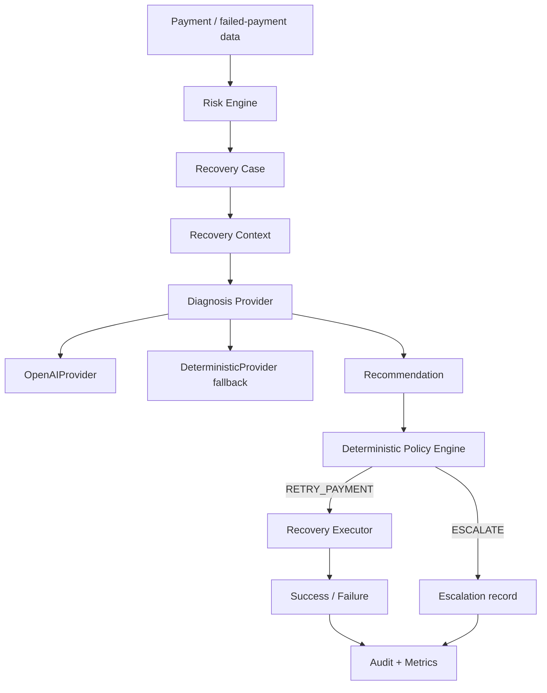

# RecoverAI

AI-powered revenue recovery orchestration MVP for merchants, focused on failed-payment recovery and safe, auditable actioning.

## 1. Problem

Failed payments create revenue at risk for merchants. When the failure volume grows, manual investigation and recovery do not scale. A merchant needs to determine:

- what revenue is currently at risk
- why a payment failed
- what recovery action is appropriate
- whether that action is permitted under deterministic policy rules
- whether the action actually recovered revenue

RecoverAI addresses this by turning payment failures into structured recovery cases and guiding them through diagnosis, approval, execution, and measurement.

## 2. Solution

The implemented flow is:

Revenue-at-risk detection
→ risk scoring and prioritization
→ recovery context assembly
→ AI diagnosis/recommendation
→ deterministic policy validation
→ bounded recovery or escalation
→ measured outcome
→ audit trail

This is an orchestration pipeline rather than a direct AI execution system. The project models a realistic operational loop: identify revenue risk, decide whether a case merits retry or escalation, and measure the outcome without allowing arbitrary AI actions to execute directly.

## 3. Key Design Principle

> AI recommends. Deterministic policy controls execution.

This is a central safety rule in RecoverAI. A recommendation from the AI is never treated as an executable financial instruction on its own. Instead, the recommendation is validated through a deterministic policy engine before any recovery action is allowed to run. This prevents unsafe or unapproved customer-impacting actions from executing just because an LLM recommended them.

## 4. What is implemented

The project currently implements the following functionality in the MVP:

- failed payment recovery workflow
- risk scoring and prioritization for failed payments
- recovery case creation from failed payments
- deterministic diagnosis provider
- OpenAI diagnosis provider abstraction
- deterministic fallback for unavailable or failed AI diagnosis
- policy validation for proposed recovery actions
- bounded retry execution in test mode
- escalation for non-retryable payment states
- idempotency protection for retry attempts
- audit events for decisions and recoveries
- batch recovery metrics
- read-only demo dashboard
- automated tests

This does not include checkout-abandonment recovery or overdue invoice recovery; those would be future extensions rather than implemented capabilities in the current MVP.

## 5. AI Architecture

The implemented AI layer is intentionally narrow and structured.

### RecoveryContext

The system converts payment data into a `RecoveryContext` object containing only the values needed for diagnosis:

- payment ID
- amount
- currency
- payment status
- failure reason
- risk score
- priority

This avoids exposing ORM objects or database session state to the provider layer.

### Diagnosis provider abstraction

`RecoveryDiagnosisProvider` is the common interface for diagnosis providers. It accepts a `RecoveryContext` and returns a validated `RecoveryRecommendation`.

### OpenAIProvider

The project includes an `OpenAIProvider` that uses the OpenAI Responses API with structured output validation. It produces a diagnosis, recommended action (`RETRY_PAYMENT` or `ESCALATE`), confidence score, and rationale.

### DeterministicProvider

The project also includes a rule-based `DeterministicProvider` that maps known temporary and customer-impacting failure reasons to a recommendation. This is the safety fallback used in the demo and in the workflow when the AI provider is unavailable or fails.

### Fallback behavior

`diagnose_with_fallback()` first attempts the configured provider. If the provider fails or is unavailable, it falls back to the deterministic provider and labels the result clearly as a fallback. Under no circumstance does the application allow an unvalidated direct AI action to trigger business execution.

### Recommendation validation

Before a recommendation is used, it is validated to ensure it is non-empty, action-supported, and has confidence within the expected range. This keeps the AI output constrained to the defined recommendation schema.

### Diagnosis confidence

Confidence is part of the recommendation payload and is used as a diagnostic indicator, not as an execution permission. In the current deterministic provider it is heuristic and not statistically calibrated.

### Why AI does not directly execute payment actions

The system architecture separates recommendation from execution. The AI layer may diagnose and suggest a course of action, but the policy engine decides whether that action is allowed, and the recovery executor performs only the approved action. This is central to the project’s safety model.

The measured dashboard demo currently runs with the deterministic provider because the OpenAI account used during development exhausted its API credits. The demo numbers and the dashboard do not represent an LLM-generated recovery result.

## 6. Safety / Guardrails

The application includes several safety checks and operational guardrails:

- deterministic policy gate before any action is allowed
- temporary failures such as bank timeout or network issues may be retried
- customer/payment-state failures such as expired cards, declines, and insufficient funds are escalated
- one retry per case is protected by idempotency checks
- no arbitrary AI-generated action can execute without policy validation
- audit events record decisions and recovery actions
- the dashboard and workflow demo operate without live payment gateway mutation
- bounded recovery execution is used in the test-mode workflow
- escalation is used to stop unsafe or unsupported automatic action

The workflow is intentionally conservative: a recommendation alone is not enough to trigger a financial action.

## 7. Measured Results

The current verified batch result over the seeded demo dataset is:

- 70 failed/recovery cases
- ₹429,180 revenue at risk
- ₹219,014 recovered
- 36 cases recovered
- 34 cases escalated
- 0 policy-blocked cases
- 51% recovery rate

This is a deterministic, test-mode batch over the seeded dataset, not an LLM-generated recovery claim. The recovered amount is from the temporary technical failure categories represented in the seeded batch. These results are meant to illustrate the orchestration model and dashboard rather than a production recovery outcome.

## 8. Dashboard

The FastAPI dashboard is read-only and shows the current seeded demo snapshot:

- revenue at risk
- revenue recovered
- recovery rate
- recovered cases
- escalated cases
- policy-blocked cases
- risk score and priority
- recommendation
- diagnosis confidence
- policy decision
- execution result

The dashboard provides a judge-facing overview of the end-to-end orchestration flow without mutating the live seeded database.

## 9. Architecture diagram



This diagram reflects the actual implemented architecture in the MVP.

## 10. Project Structure

Important project files and their roles:

- `app/__init__.py` — package marker
- `app/ai_agent.py` — diagnosis providers, validation, fallback logic
- `app/create_recovery_cases.py` — creates recovery cases for failed payments
- `app/database.py` — database session and engine configuration
- `app/evaluate_risk.py` — risk scoring summary over failed payments
- `app/main.py` — FastAPI app and read-only dashboard endpoints
- `app/models.py` — ORM models for merchants, payments, recovery cases, actions, and audit logs
- `app/policy_engine.py` — deterministic policy gate for allowed actions
- `app/recovery_executor.py` — deterministic, test-mode recovery execution logic
- `app/recovery_workflow.py` — orchestration of AI recommendation + policy + execution for a case or batch
- `app/risk_engine.py` — scoring logic for payment failure severity and priority
- `app/seed.py` — seeds synthetic failed and successful payments for the demo dataset
- `app/tests/` — unit and workflow tests covering the MVP behavior

## 11. Running Locally

Use the commands below from the project root.

### 1) Create and activate a virtual environment

```bash
python3 -m venv .venv
source .venv/bin/activate
```

### 2) Install dependencies

```bash
pip install -r requirements.txt
```

### 3) Seed the demo data

```bash
python -m app.seed
```

### 4) Evaluate risk over the seeded failed payments

```bash
python -m app.evaluate_risk
```

### 5) Create recovery cases from failed payments

```bash
python -m app.create_recovery_cases
```

### 6) Run the test suite

```bash
.venv/bin/pytest -q
```

### 7) Start the FastAPI dashboard

```bash
uvicorn app.main:app --reload
```

### 8) Open the dashboard

Visit:

```text
http://127.0.0.1:8000/
```

## 12. OpenAI Configuration

The project includes a sample environment file at `.env.example`:

```dotenv
OPENAI_API_KEY=
```

This key is optional for the MVP. If it is missing, the system can still run using the deterministic provider. Live OpenAI diagnosis is therefore optional, while the deterministic fallback ensures the workflow continues safely without API credits. This is important for demo reliability and safety.

## 13. Testing

The current verified result is:

- 93 passed
- 13 subtests passed

This is the current measured state of the project’s automated tests.

## 14. Limitations

This project is intentionally a focused MVP and has several limitations:

- it uses seeded synthetic data rather than live merchant production data
- it does not mutate a live payment gateway or production payment API
- the OpenAI live call path was blocked during development because the account had exhausted API credits
- the measured dashboard result is produced with the deterministic provider, not an LLM-generated recovery outcome
- confidence values in the deterministic fallback are heuristic and not statistically calibrated
- the current recovery focus is on failed payments only
- production deployment would require real payment API integration, stronger observability, authentication, rate limiting, and production-grade privacy/security controls

## 15. Future Extensions

Short-term extensions include:

- calibrated recovery likelihood models
- richer customer and payment history context
- real Razorpay test-mode or sandbox integration
- additional revenue-loss sources such as subscription failures and checkout abandonment
- experiment-based recovery strategies

## 16. Buildathon Fit

RecoverAI aligns directly with Razorpay Track 03: AI Revenue Recovery by:

- detecting revenue at risk
- determining the likely root cause of failed payments
- choosing an appropriate intervention
- executing a bounded recovery only when allowed
- measuring recovered money
- escalating risky cases safely
- maintaining an auditable trail for operational trust

This is a practical, explainable orchestration MVP designed for a merchant-facing revenue recovery workflow.

## 17. License / Notes

This repository is intended for demo and buildathon evaluation purposes. It is not a production payment-processing system and does not initiate live financial actions against any external payment platform in the current demo mode.

---

For a concise technical overview of the architecture, see [ARCHITECTURE.md](ARCHITECTURE.md).
